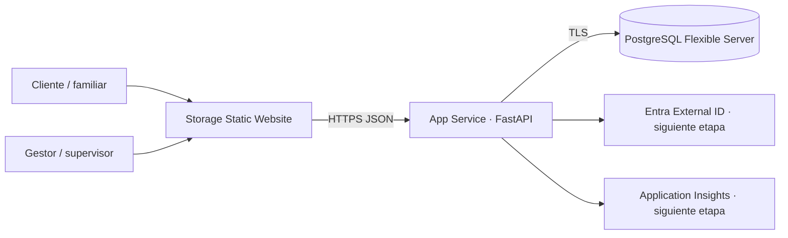

# Arquitectura del MVP

## Decisiones

El frontend es HTML/CSS/JavaScript estático para que Azure Storage Static Website lo sirva sin proceso de servidor. La API es FastAPI en Azure App Service Linux: un PaaS sencillo, portable y con escalamiento independiente. PostgreSQL Flexible Server conserva el estado transaccional y permite evolucionar a búsquedas, colas y analítica sin acoplar el dominio a Azure.

## Dominios

- **Identidad y acceso:** cliente, beneficiario, gestor, supervisor y administrador. El código incorpora autorización por rol; el encabezado demo solo es válido fuera de producción. El despliegue productivo debe validar JWT de Entra External ID.
- **Catálogo OPS:** procedimiento versionado por entidad, ciudad, categoría, modalidad, riesgo, requisitos y pasos.
- **Solicitudes:** expediente con solicitante, beneficiario, OPS, estado, asignación y consentimiento.
- **Operación:** máquina de estados cerrada; las transiciones inválidas devuelven conflicto.
- **Auditoría:** cada evento incluye actor, acción, instante, payload mínimo y hash del evento anterior. La cadena evidencia alteraciones, pero no sustituye un almacén WORM; para producción se recomienda exportar a Blob Storage con immutability policy.

## Flujo

`submitted → triaged → assigned → in_progress → waiting_user/completed/failed → closed`

Cancelación es posible antes del cierre. Un gestor solo modifica sus casos; supervisor y administrador pueden intervenir. Ningún payload debe contener secretos.

## Controles mínimos antes de datos reales

1. Entra External ID, MFA para operación y autorización por claims.
2. Identidades administradas y Key Vault; eliminar contraseña de DB en App Settings.
3. PostgreSQL con acceso privado/VNet y Storage detrás de Front Door + WAF.
4. cifrado de campos sensibles, malware scanning de adjuntos y enlaces de descarga temporales.
5. Application Insights con redacción de PII; alertas e incident response.
6. copias, restauración probada, retención/supresión y exportación de auditoría inmutable.
7. revisión jurídica, contratos con encargados y evaluación de impacto de privacidad.

## Limitaciones deliberadas

No se automatizan portales de terceros ni se almacenan credenciales. No hay pagos, chat, adjuntos ni notificaciones. La infraestructura expone PostgreSQL a servicios Azure mediante regla de firewall para simplificar el MVP; debe migrarse a red privada antes de producción.

