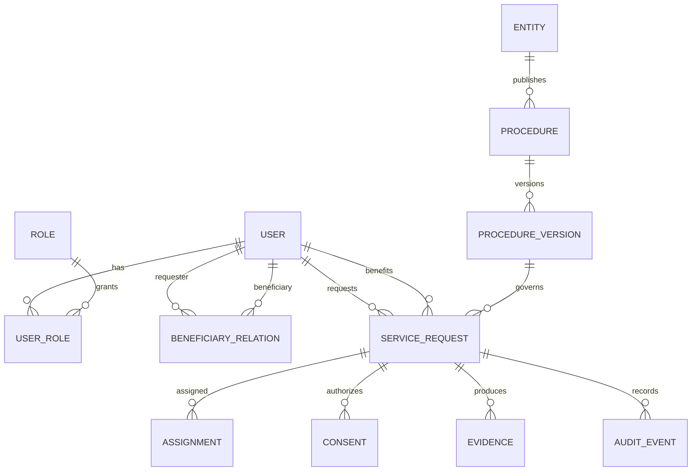

# Modelo de datos inicial

El MVP implementa físicamente `procedures`, `requests` y `audit_events`; las demás entidades son el esquema objetivo de la siguiente migración.

| Entidad | Campos esenciales | Regla |
|---|---|---|
| User | id, identity_subject, contact, status | PII separada del expediente |
| Role/UserRole | role, user_id, scope | menor privilegio |
| BeneficiaryRelation | requester, beneficiary, basis, valid_until | pagar no equivale a consentir |
| Entity | name, sector, jurisdiction, official_url | no implica afiliación |
| Procedure/Version | entity, name, steps, requirements, risk, validity | ejecución fijada a una versión |
| ServiceRequest | requester, beneficiary, procedure_version, status, SLA | sin credenciales/OTP |
| Assignment | request, manager, accepted_at, ended_at | historial, no sobreescritura |
| Consent | subject, purpose, version, evidence, granted/revoked_at | salud separado y explícito |
| Evidence | type, blob_uri, hash, classification, retention_until | acceso temporal |
| AuditEvent | actor, action, payload, previous_hash, event_hash, occurred_at | append-only lógico |

Índices iniciales: solicitudes por estado/fecha, procedimientos por entidad/categoría, auditoría por solicitud/fecha. El identificador público debe ser distinto del identificador interno cuando se habiliten enlaces externos.

